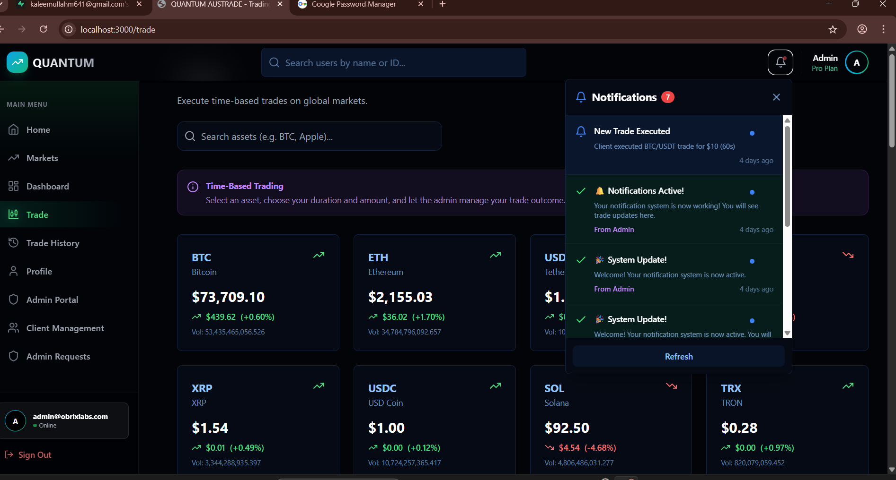

# Crypto Genix - Advanced Crypto Trading Platform

A sophisticated, production-grade crypto trading platform built with **Next.js 14**, **TypeScript**, and **Supabase**. Crypto Genix delivers a real-time trading experience with simulated markets, live portfolio tracking, and a comprehensive admin management system.

**⚠️ PERSONAL USE ONLY. COMMERCIAL DISTRIBUTION IS STRICTLY PROHIBITED.**



## 🚀 Key Features

### 🖥️ User Dashboard
- **Real-Time Portfolio Tracking**: Dynamic updates of total portfolio value, combining cash balance and stock holdings.
- **Advanced Gamification**:
    - **Trader Levels (1-10)**: Calculated based on trading activity and success.
    - **Credit Score System**: Visual health indicator of trading performance.
- **Live Market Data**: Integrated with **CoinLore API** and simulated stock feeds to provide real-time pricing for Stocks (AAPL, TSLA, etc.) and Crypto.
- **Interactive Charts**: Line and Candlestick charts powered by Recharts.
- **Watchlist & Market Movers**: Real-time tracking of top gainers/losers.

### 💰 Trading System
- **Long/Short Trading**: Execute Market Call (Long) and Put (Short) options.
- **Real-Time Simulation**: Trades are processed in real-time, with results (Win/Loss) determined by live market price simulations.
- **Instant Notifications**: Socket-like notification system alerts users immediately upon trade completion with Win/Loss amounts.
- **Transaction History**: Comprehensive log of all active and past trades.

### �️ Admin Portal
- **User Management**: View comprehensive user profiles, including balances, credit scores, and positions.
- **Balance Control**: Manually deposit/withdraw funds for any user.
- **Proxy Trading**: Admin can execute trades on behalf of users for support or management purposes.
- **System Monitoring**: real-time oversight of all platform activity.

### � Security & Architecture
- **Supabase Authentication**: Secure email/password login and session management.
- **Row Level Security (RLS)**: Strict database policies ensuring users access only their own data.
- **Service Role architecture**: Dedicated Admin Client ensuring secure, elevated access for backend operations while keeping client-side access restricted.
- **Robust API**: RESTful API routes with aggressive cache control for fresh data delivery.

## 📦 Tech Stack

- **Frontend**: Next.js 14 (App Router), React, Tailwind CSS, Framer Motion
- **Backend**: Next.js API Routes, Supabase (PostgreSQL + Auth)
- **State Management**: React Hooks & Context API
- **Visualization**: Recharts, Lucide Icons

## 🛠️ Installation

1. **Clone the Repository**
   ```bash
   git clone https://github.com/anasraheemdev/crypto-genix.git
   cd crypto-genix
   ```

2. **Install Dependencies**
   ```bash
   npm install
   ```

3. **Environment Setup**
   Create a `.env.local` file in the root directory and add your Supabase credentials:
   ```env
   NEXT_PUBLIC_SUPABASE_URL=your_supabase_url
   NEXT_PUBLIC_SUPABASE_ANON_KEY=your_supabase_anon_key
   SUPABASE_SERVICE_ROLE_KEY=your_service_role_key
   ```

4. **Run Development Server**
   ```bash
   npm run dev
   ```

5. **Access Application**
   Open [http://localhost:3000](http://localhost:3000) in your browser.

## 🔒 Proprietary Notice

**Copyright (c) 2026 Anas Raheem. All Rights Reserved.**

**THIS IS A PRIVATE APPLICATION.**

This source code is the sole property of Anas Raheem. It is not open source.
- **No Use Without Permission**: You may not use, copy, modify, or distribute this software without explicit written permission from the owner.
- **Confidential**: The contents of this repository are confidential and proprietary.

Any unauthorized use is strictly prohibited.
